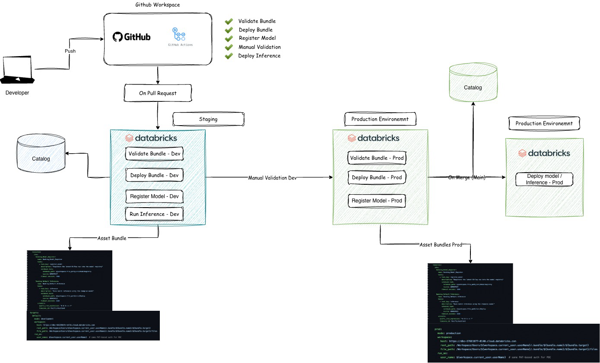

🔍 1. What Are Databricks Asset Bundles?

Databricks Asset Bundles (DAB) are a declarative configuration framework that allows you to package an entire ML/Data project — code, jobs, notebooks, pipelines, compute, permissions, and artifacts — into a reproducible and deployable bundle.

Key Benefits:

Infrastructure-as-code for Databricks

Environment-independent deployment: dev, staging, prod

Unified definition of jobs, permissions, clusters, models

Seamlessly integrates with CI/CD systems

Enables drift-free, governed deployments

A bundle is defined using a databricks.yml file and optionally modular YAML files in a resources/ folder.

⚙️ How Asset Bundles Work Internally

At a high level, Databricks Asset Bundles act as a declarative layer that translates your project’s configuration into real Databricks resources. Instead of manually configuring jobs, clusters, and workflows inside the Databricks UI, bundles allow you to define everything in YAML and deploy it consistently across environments.

When you run a bundle command, Databricks performs three main actions:

1. Configuration Resolution

It applies environment-specific overrides (Dev, Staging, Prod).

It builds a final deployment plan containing all jobs, notebooks, compute, and workflows.

2. Deployment to Databricks

The CLI syncs notebooks, code, and workflow definitions into the target workspace.

It creates or updates Databricks Jobs (training, inference, registration).

It attaches the right permissions and compute settings for that environment.

3. Execution & Lifecycle Management

Jobs defined in the bundle can be executed directly using bundle run.

MLflow handles model tracking, versioning, and registration.

Promotion to the next environment is controlled through CI/CD (GitHub Actions).

Across all environments, Asset Bundles ensure:

Repeatability (same bundle deployed the same way)

Consistency (Dev → Staging → Prod use the same definitions)

Environment awareness (targets handle differences between environments)

🏗️ POC Architecture

This POC implements a streamlined MLOps workflow using Databricks Asset Bundles, GitHub Actions, and MLflow, deployed across two environments only:

Development

Production

The architecture is intentionally simplified to demonstrate an enterprise-aligned workflow without additional staging layers.

Developer Workflow

The developer performs model experimentation and training directly inside the Databricks UI (Dev workspace).

Once satisfied with the model training logic and outputs, the developer creates a Pull Request (PR) in GitHub.

The PR automatically triggers the CI/CD pipeline.

CI/CD Workflow (GitHub Actions)

When a PR is opened or updated, GitHub Actions performs the following steps in the Development environment:

Validate Bundle
Ensures the Asset Bundle configuration and environment settings are correct.

Deploy to Dev
Syncs notebooks, source code, workflows, and compute definitions into the Dev workspace.

Run Inference / Evaluation
Executes the inference or evaluation workflow to confirm model consistency.

Register Model (Dev)
Registers the newly trained model version into the MLflow Model Registry (Unity Catalog–backed).

Manual Approval Gate
A GitHub Environment approval step ensures a human reviews model results before promotion.

Promotion to Production

After approval:

The same Asset Bundle is deployed to Production using the --target=prod configuration.

The validated model is promoted within MLflow to the appropriate production alias (production / champion).

Production jobs and serving endpoints are updated to reference the new alias.

The model becomes live for inference.

